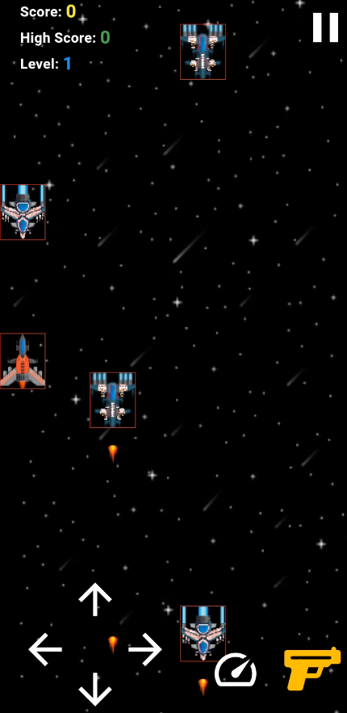

<h2>Stellar War 🚀</h2>

A thrilling space battle game where you command a spaceship, collect bonuses, and fight for survival in an endless cosmic war!  
**💰 Monetization & Open Source – Support the Mission!**  
**🌟 Help Shape the Future of Stellar War!** 
**🚀 Stellar War** is more than just a game—it's a community-driven project built with passion. As an open-source game, anyone can contribute, improve, and enjoy it freely. But to keep this project thriving, we need your support!  
**How You Can Help** 
**💖 Become a GitHub Sponsor** – Your donations help fund development, new features, and server costs. 
**🎯 In-Game Rewards & Supporter Badges** – Get exclusive in-game bonuses or a special shoutout in the game credits! 
**🛍️ Marketplace Releases** – If the game gains traction, premium add-ons or skins could help sustain development. 
**📢 Spread the Word!** – Even if you can't donate, sharing the game with others helps a lot!  
**Why Donate?** 
✅ Support an indie developer (independent developer) passionate about building great games. 
✅ Help add new levels, enemies, multiplayer mode, and more! 
✅ Keep the project free and open for everyone to enjoy.  
If you love **Stellar War**, consider supporting the project! 🚀 [💙 Sponsor on GitHub](https://github.com/sponsors/bunchhoeuninfo)    
Enjoying **Stellar War**? Support my work with a coffee!
  

**Every contribution, no matter the size, fuels the future of Stellar War! 🚀✨**  
📜 **About the Game** 
Stellar War is an action-packed space shooter built with Flutter and Flame Engine. Players navigate through an infinite galaxy, dodging enemy fire, collecting power-ups, and racking up high scores.  
🎮 **Features** 
🚀 Engaging Space Combat – Battle against waves of enemies in a fast-paced environment. 
⭐ Bonus Objects – Collect power-ups, shields, and special weapons to boost your gameplay. 
📊 Scoreboard System – Compete with yourself or others by achieving the highest score. 
🎨 Stunning Graphics – Retro-style space visuals with smooth animations. 
🎶 Immersive Sound Effects – Feel the intensity of space battles with dynamic audio.  
🛠️ **Tech Stack** 
Flutter – For cross-platform game development. 
Flame Engine – For 2D game mechanics and physics. 
Dart – For game logic and performance optimization.  
🚀 **How to Play** 
Tilt or touch to control your spaceship. 
Avoid enemy attacks and obstacles. 
Shoot enemies to score points. 
Collect bonuses for extra power-ups. 
Survive as long as possible and set a new high score!  
**Gameplay Screenshot** 
  
📌 **Future Updates** 
Multiplayer mode. 
More enemy types and boss fights. 
New space environments and weapons.  
📧 **Contact & Contributions** 
Feel free to contribute to the project! If you have suggestions, open an issue or submit a pull request.  

👨‍💻 Developed by Bunchhoeun CHHIM 
📩 Reach me at: bunchhoeun.chhim@gmail.com 
